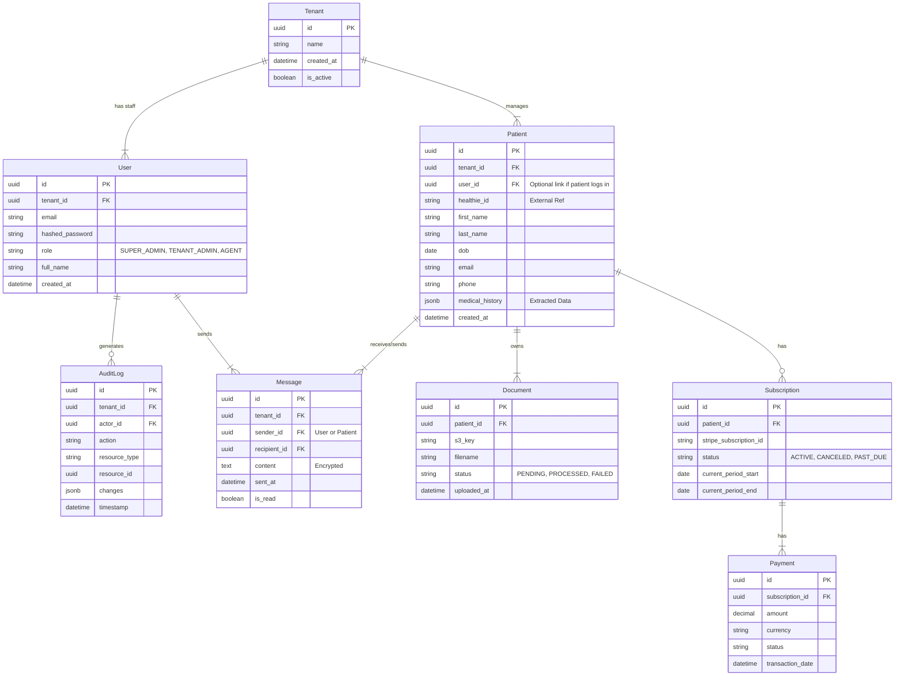

# Data Model: Initial SaaS Starter MVP Platform

## ER Diagram (Mermaid)

## Entity Details

### Tenant
- **Purpose**: Logical isolation boundary.
- **RLS**: All other tables (except Super Admin data) must have `tenant_id` and RLS enabled.

### User
- **Roles**:
    - `SUPER_ADMIN`: Cross-tenant access (system maintenance).
    - `TENANT_ADMIN`: Manage users within their tenant.
    - `AGENT`: Read/Write patients, handle tasks.

### Patient
- **Data**: Core demographic data.
- **Sync**: `healthie_id` stores the reference to the external EHR record.
- **Security**: Name, DOB, Phone are PII/PHI - must be encrypted at rest if not relying solely on volume encryption.

### Message
- **Compliance**: Content must be encrypted.
- **Retention**: Permanent retention in DB for audit.

### Document
- **Storage**: Metadata in DB, binary content in private S3 bucket (SSE-KMS encrypted).
